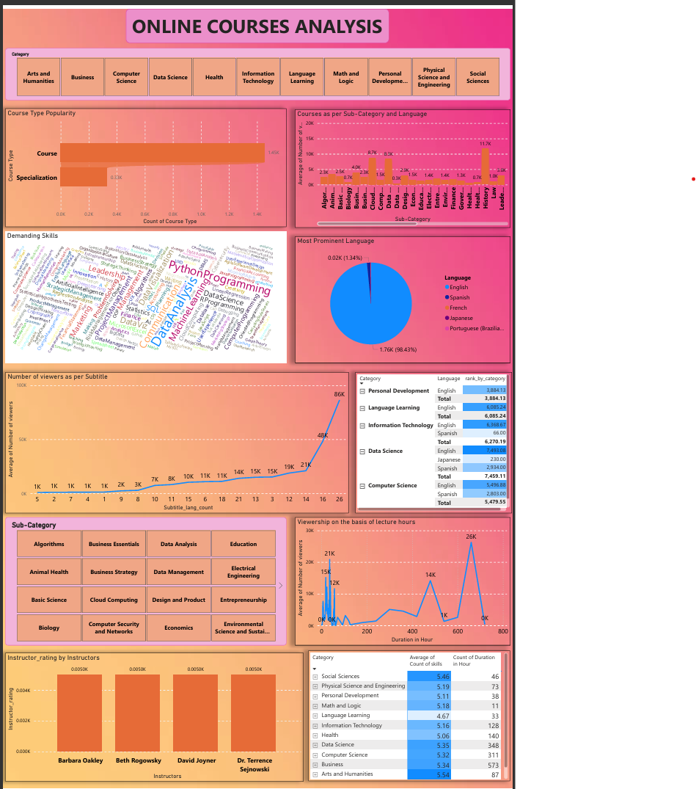

# 📊 EdTech Recorded Lectures Analysis Dashboard – Power BI Project

## 🔍 Overview

This Power BI project analyzes recorded lecture data collected from various EdTech platforms to uncover key insights and help an EdTech startup strategically expand its content offerings. The focus is **category-wise**, ensuring all decisions are aligned with user demand and market trends.

---

## 🧠 Business Problem

The startup wants to grow its recorded lecture segment but lacks data-backed direction on:

- Which course types and categories are trending?
- What languages are preferred by learners?
- Which instructors and skills generate the most engagement?
- How do subtitles and course duration impact views?

---
## Glims
- 

## 🎯 Objectives

- Analyze **course distribution** across categories and subcategories
- Calculate **average views** by category, sub-category, and language
- Identify **top skills** per category aligned with job market demand
- Determine **language distribution** and **preferences**
- Analyze **subtitle availability vs views**
- Identify **top 3 instructors** (based on ratings) per category and sub-category
- Understand the **impact of course duration** on engagement
- Investigate whether **skill variety** affects viewership

---

## 📁 Dataset Summary

Fields used in the dataset include:

- `Category`, `Sub-Category`
- `Course Type`, `Language`, `Subtitle Availability`
- `Views`, `Ratings`, `Course Duration`
- `Skills Taught`, `Instructor`

> Data cleaning and transformation were done using **Power Query** in Power BI.

---

## 📊 Dashboard Features

- 📌 Category & sub-category level insights
- 📈 View trends by language and subtitles
- 🌍 Language preferences for top categories
- 🧑‍🏫 Top instructors based on user ratings (static visual)
- ⏱️ Duration vs views by course type
- 🔤 Skill variety impact on engagement

---

## 🛠 Tools Used

- Power BI Desktop  
- Power Query & DAX  
- Excel/CSV for input  
- *(Optional)* Python for preprocessing

---

## 🔍 Key Insights

- Categories like `Technology` and `Business` dominate in views
- Courses with **subtitles** have notably higher engagement
- Language preferences vary across categories, English dominates
- Most users prefer **short-to-mid duration** courses (~60 hrs/month)
- Top instructors can be strategically partnered with
- More **skill variety** leads to better viewership in flexible formats

